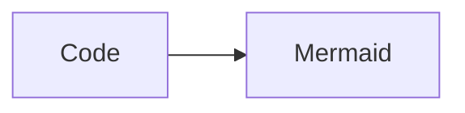

---
layout: content
footer: false
sectionBar: false
---

<!-- slide 2: global lineHeight and flowGap defaults -->

# Global Rhythm

Body paragraph using global line height.

<Block title="First block">

Global flow gap should apply after this block.

</Block>

<Callout type="note" title="Second block">

Adjacent top-level content blocks should share the same flow rhythm.

</Callout>

---
layout: content
lineHeight: 1.35
flowGap: 1.25rem
footer: false
sectionBar: false
---

<!-- slide 3: slide-level rhythm overrides -->

# Local Rhythm

Body paragraph using local line height.

<Block title="First block">

Local flow gap should override the global default.

</Block>

<Callout type="tip" title="Second block">

Adjacent top-level content blocks should use the local rhythm.

</Callout>

<FigureBlock
  src="data:image/svg+xml,%3Csvg xmlns='http://www.w3.org/2000/svg' width='320' height='48' viewBox='0 0 320 48'%3E%3Crect width='320' height='48' fill='%23e5eefb'/%3E%3C/svg%3E"
  caption="Flow gap figure"
  width="42%"
/>

<TableBlock caption="Flow gap table">

| Metric | Value |
| --- | ---: |
| A | 1 |

</TableBlock>

---
layout: content
density: dense
footer: false
sectionBar: false
---

<!-- slide 4: explicit global rhythm wins over dense variable swaps -->

# Dense Global Rhythm

Body paragraph using global line height on a dense slide.

<Block title="First block">

Global flow gap should remain explicit under dense density.

</Block>

<Callout type="important" title="Second block">

Dense density should not replace explicit global flow gap.

</Callout>

---
layout: split
lineHeight: 1.4
flowGap: 2ch
footer: false
sectionBar: false
---

<!-- slide 5: split layout supports local rhythm overrides -->

# Split Rhythm

::left::

Split body text using local line height.

::right::

<Block title="First block">

Split local flow gap should apply after this block.

</Block>

<Callout type="note" title="Second block">

Split local flow gap should apply between top-level blocks.

</Callout>

---
layout: content
lineHeight: 1.35
flowGap: 1.25rem
footer: false
sectionBar: false
---

<!-- slide 6: Slidev-rendered flow blocks share the same rhythm -->

# Rendered Flow Blocks

```ts
const rhythm = 'flowGap'
```



<PlotlyGraph filePath="/Graph/plotly1.json" :graphHeight="160" :graphWidth="360" />

---
layout: split
lineHeight: 1.4
flowGap: 1rem
footer: false
sectionBar: false
---

<!-- slide 7: split column flow blocks use the split rhythm -->

# Split Component Rhythm

::left::

<Block title="Left block">

Split column blocks should use `flowGap`.

</Block>

<Callout type="note" title="Left callout">

Adjacent split column blocks should share the same gap.

</Callout>

::right::

<PlotlyGraph filePath="/Graph/plotly1.json" :graphHeight="150" :graphWidth="320" />

<Block title="Right block">

Plotly and component blocks should share the same gap.

</Block>

---
layout: content
lineHeight: 1.35
flowGap: 1.25rem
footer: false
sectionBar: false
---

<!-- slide 8: media and transformed output use flowGap -->

# Media Flow Blocks

<QRCode url="https://ustc.edu.cn" :size="72" caption="QR rhythm" />

<VideoBlock src="/videos/sample_video.mp4" caption="Video rhythm" width="44%" :videoWidth="260" />

```typst
#box[Typst rhythm]
```

---
layout: content
lineHeight: 1.35
flowGap: 1.25rem
footer: false
sectionBar: false
---

<!-- slide 9: nested generated blocks keep their internal spacing -->

# Nested Flow Boundary

<Block title="Nested generated block">

```ts
const nested = true
```

</Block>

---
layout: content
lineHeight: 1.35
flowGap: 1.25rem
footer: false
sectionBar: false
---

<!-- slide 10: Markdown flow before components uses flowGap -->

# Markdown Flow Rhythm

Paragraph before a component should use the same flow gap.

<Block title="After paragraph">

The gap above this block should match `flowGap`.

</Block>

- List item before a component should use the same flow gap.

<Callout type="note" title="After list">

The gap above this callout should also match `flowGap`.

</Callout>

---
layout: content
footer: false
sectionBar: false
---

<!-- slide 11: Block floating label style and color prop -->

# Block Style

<Block title="Default block">

Default title uses the theme accent without a solid label fill.

</Block>

<Block title="Green block" color="#065f46">

Custom color changes the title and outline color family.

</Block>

<Block title="A deliberately long theorem label that can wrap without overlapping body text">

Wrapped titles should reserve enough vertical space before the body starts.

</Block>

---
layout: content
density: dense
footer: false
sectionBar: false
---

<!-- slide 12: dense Block floating label spacing stays compact -->

# Dense Block Style

<Block title="Definition">

Dense block spacing should remain compact but not collide.

</Block>

<Block title="Lemma 2">

Adjacent dense blocks should keep visible label breathing room.

</Block>

---
layout: split
footer: false
sectionBar: false
---

<!-- slide 13: split code block before titled Block leaves room for the floating label -->

# Code Before Block

::left::

Context text.

::right::

```ts
const stage = 'synthetic supervised grounding'
```

<Block title="Effect">

The floating label should not collide with the preceding code block.

</Block>
